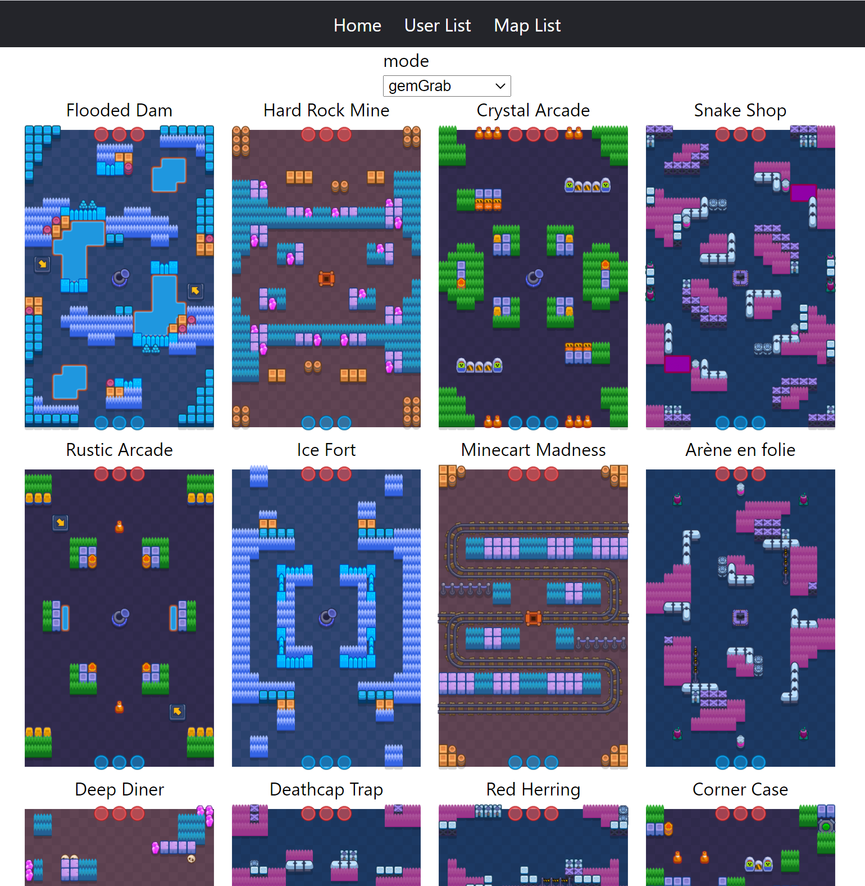
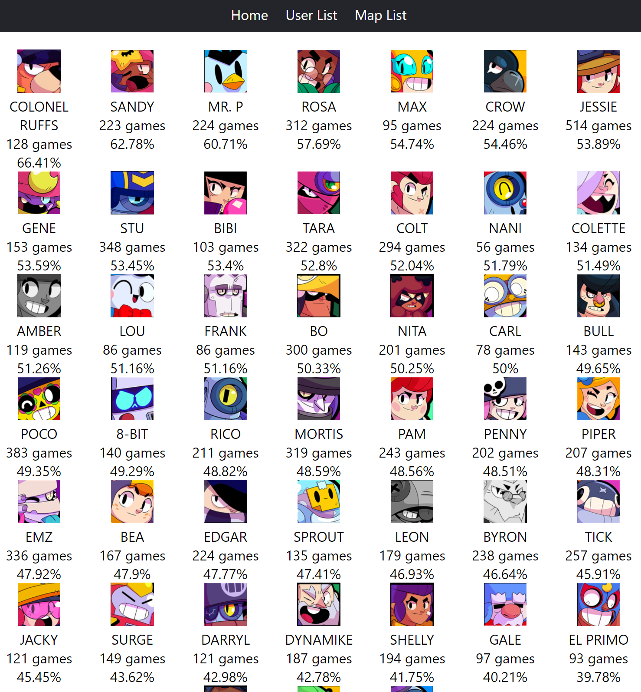

## README 翻訳

- [English README](README.md)
- [한국어 README](README-KO.md)

## プロジェクト紹介

Brawl Meta は Brawl Stars の各マップにおけるブロウラーの勝率統計を提供するサイトです。

ゲームに勝つためには強いブロウラーを選ぶ必要がありますが、公式の勝率統計は存在しませんでした。以前は自分でゲームをプレイしながら強いブロウラーを見つけていました。しかし、ゲームのマップは毎日変更され、シーズンごとに新しいマップが追加されるため、更新に追いつくのは簡単ではありません。

この Brawl Meta サイトでは、各マップに最適なブロウラーとその勝率を見つけることができます。勝率は約 10,000 人のランダムなプレイヤーのプレイデータに基づいています。

### 詳細情報

Brawl Stars API を使用してユーザープレイデータを取得し、統計を生成しました。API では最新の 25 ゲームのみを照会できるため、できるだけ多くのゲームを保存するために、毎時マッチ履歴を保存しています。

フロントエンドは React で構築されており、バックエンドは Spring フレームワークを使用して開発されています。

Players メニューでは、ユーザーの名前をクリックすることでそのマッチ履歴を表示できます。

Maps では、各モードのマップを確認でき、マップ画像をクリックするとブロウラーの勝率を見ることができます。

### 技術スタック

このプロジェクトには、React、Spring Boot、JPA が使用されています。
Spring Boot の Scheduler を利用して、ユーザーデータを定期的に更新しています。

### 実装された機能

- UserList でユーザーをクリックすると、そのバトル履歴が表示されます。V1.0 とは異なり、モードに関係なく記録を表示できるようになりました。
  ユーザー名でバトル記録を検索することができます。（V1.0 と同様）
- 3v3 マッチメイキングでは、各マップでのブロウラーの勝率を確認できます。
- 上部の Map List をクリックすると、各モードのマップを確認できます。また、マップをクリックすると、各ブロウラーの勝率を確認できます。

### アップデートログ

- v2.4.7 (2024.07.24)
- 5v5 モードをサポート
- v2.4.6 (2024.07.14)
  - マップリストページに検索入力を追加
- v2.4.5 (2024.04.16)
  - 新しいトロフィー逃走モードを追加
- v2.4.1 (2023.03.21)
  - Spring Boot を 3.0.4 にアップデート
- v2.4.0 (2023.01.05)
  - マップページに説明を追加
  - getStatistics API を全データ取得に変更
  - 新しいブロウラー Mandy を追加
- v2.3.9 (2022.11.08)
  - 新しいブロウラー Buster を追加
  - マップ画像と翻訳を追加
- v2.3.8 (2022.06.30)
  - Hunters モードと新しいブロウラー Otis を追加
  - 新しいマップの翻訳を追加
  - バグ修正: ユーザーリストでニックネーム検索値がエンコード文字として表示される問題を修正
- v2.3.7 (2022.05.10)
  - ログインターセプターの変更によるページの読み込み時間の短縮
  - バトルログ表示の遅延を減らすためにフェッチジョインを使用
  - 統計ページにモード名を追加
- v2.3.6 (2022.05.08)
  - バグ修正: Bot Drop がメインページに表示される問題を修正
- v2.3.5 (2022.05.07)
  - データ転送を減らすためにレコード保存ロジックを最適化
- v2.3.4 (2022.05.03)
  - マップ統計のキャッシュを有効化
  - Bot Drop マップ画像を追加
- v2.3.3 (2022.05.02)
  - 新しいブロウラー画像（Janet と Bonnie）を追加
  - マップページに期間選択機能を追加
  - イベントロジックの最適化
- v2.3.2 (2022.04.29)
  - Bot Drop モードの統計データを収集
  - バトルレコード保存ロジックの最適化
- v2.3.1 (2022.04.14)
  - 画像のキャッシュ制御を有効にしてデータ転送を削減
- v2.3.0 (2022.03.06)
  - Duels モードの集計を追加
  - Maps でマップの最後の出現時刻を表示できるようになりました
  - Next.js に変更し、サーバーサイドレンダリングを有効化
  - Google AdSense を適用
- v2.2.0 (2022.02.12)
  - Google ボットが言語別に検索履歴を収集できるように URL に言語情報を追加
  - ナビゲーションバーのデザインを更新
  - ブログメニューを追加
- v2.1.0 (2022.02.05)
  - ドメイン名を brawlstat.xyz から brawlmeta.com に変更
  - HTTPS を適用
  - Google Analytics を追加
  - 新しいユーザータグの表示および登録機能を追加
- v2.0.2 (2021.10.04)
  - 現在のローテーションイベントリストを表示するページを追加
- v2.0.1 (2021.04.28)
  - API 呼び出し履歴を監視するためにインターセプターを追加

### ページ

- https://www.brawlmeta.com
