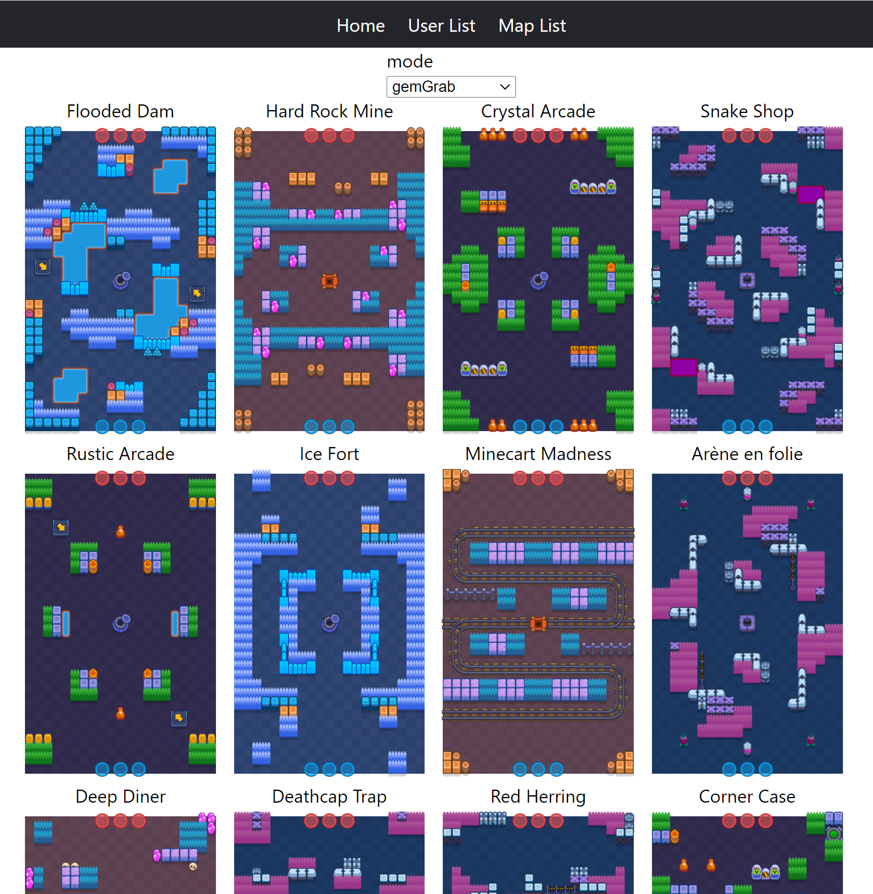
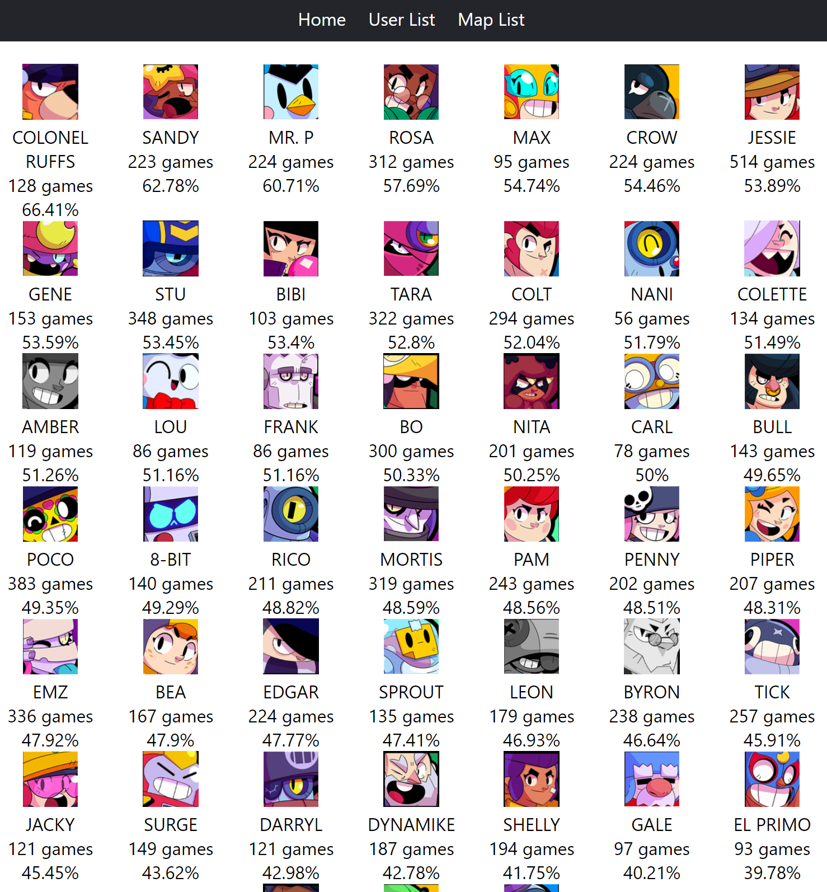

<!-- @format -->

## README Translations

- [日本語 README](README-JA.md)
- [한국어 README](README-KO.md)

## Project Introduction

Brawl Stats provides brawler win rate statistics for each Brawl Stars map.

In order to win the game, you have to select a strong brawler, but there is no official win rate statistics.
I used to find a strong brawler while playing games myself.
However, it is not easy to keep up with updates because the game maps change every day and new maps are added every season.

On this Brawl Meta site, you can find which brawler is the best for each map and the win rate.
win rates based on play data from around 10,000 random players.

#### Detailed Information

Using the Brawl Stars API, I retrieved user play data to generate statistics. Since the API only allows querying the last 25 games, I store the match history every hour to save as many games as possible.

The front-end is built with React, and the back-end is developed using the Spring framework.

In the Players menu, you can click on a user's name to view their match history.

In Maps, you can check the maps for each mode, and by clicking on a map image, you can see the brawler win rates.

### Technology Stack

React, Spring Boot, and JPA have been used for this project.
The Spring Boot's Scheduler periodically updates user data.

### Implemented Features

- In UserList, clicking on a user will show their battle history. Unlike V1.0, it now displays records regardless of the mode.
  You can search for battle records by user name. (Same as V1.0)
- In 3v3 matchmaking, you can check which brawlers have higher win rates on each map.
- By clicking on the Map List at the top, you can see which maps are available for each mode. Additionally, by clicking on a map, you can view the win rates for each brawler.

### Update Log

- v2.4.7 (2024.07.24)
  - Support 5v5 mode
- v2.4.6 (2024.07.14)
  - Add search input in map list page
- v2.4.5 (2024.04.16)
  - Add a new trophy escape mode
- v2.4.1 (2023.03.21)
  - Update spring boot to 3.0.4
- v2.4.0 (2023.01.05)
  - Add description to map page
  - Change getStatstistics API to get all data
  - Add new brawler mandy
- v2.3.9 (2022.11.08)
  - Add new brawler buster
  - Add map images and translation
- v2.3.8 (2022.06.30)
  - Add hunters mode and new brawler otis
  - Add translations of new maps
  - Bug fix : nickname search value was displayed as encoded character at user list
- v2.3.7 (2022.05.10)

  - Reduce loading time of pages by changing logging interceptor
  - Use fetch join to reduce latency of viewing battle log
  - Add mode name to statistics page

- v2.3.6 (2022.05.08)

  - Bug fix : Bot Drop is shown at main page

- v2.3.5 (2022.05.07)

  - Record saving logic optimization to reduce data transfer

- v2.3.4 (2022.05.03)

  - Cache of map statistics enabled
  - Add bot drop map images

- v2.3.3 (2022.05.02)

  - New brawlers images (Janet and Bonnie) are added
  - Period selection function is added to map page
  - Optimazatioin of getting event logic

- v2.3.2 (2022.04.29)

  - Gather statistic data of Bot Drop mode
  - Optimazation of saving battle record logic

- v2.3.1 (2022.04.14)

  - Cache-control enabled for images to reduce transferring data

- v2.3.0 (2022.03.06)
  - Updated to aggregate Duels mode.
  - You can now see the last appearance time of maps in Maps.
  - Changed to Next.js, enabling server-side rendering.
  - Google AdSense has been applied.
- v2.2.0 (2022.02.12)
  - Added language information to URLs so that Google bots can collect search records by language.
  - Updated the design of the navigation bar.
  - Added a blog menu.
- v2.1.0 (2022.02.05)
  - Changed domain name from brawlstat.xyz to brawlmeta.com.
  - Applied HTTPS.
  - Added Google Analytics.
  - Added functionality for viewing and registering new user tags.
- v2.0.2 (2021.10.04)
  - Added a page to view the current rotation event list.
- v2.0.1 (2021.04.28)
  - Added an interceptor to monitor API call history.

## Page

- https://www.brawlmeta.com
